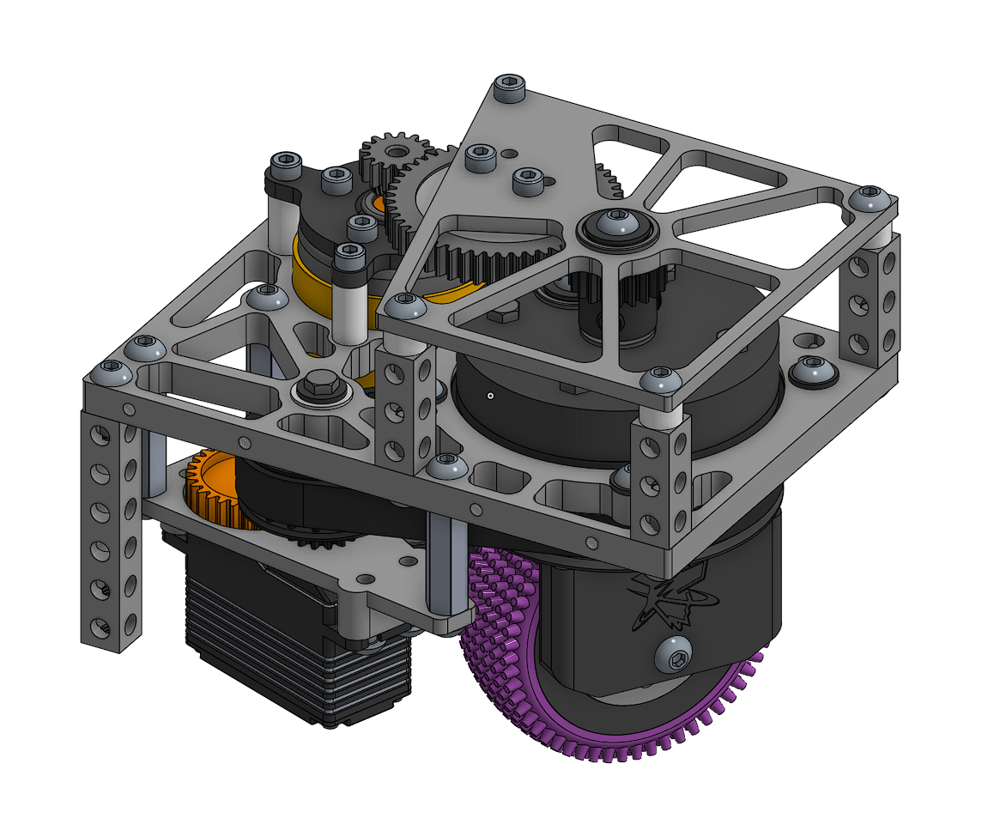

# SwerveDrive-HC-Blueprint
An Advanced omnidirectional robot drivetrain.

This is our third generation swerve drivetrain made for First Tech Challenge (FTC) inspired by the coaxial swerve drivetrains found in the First Robotics Competition (FRC). 
FTC and FRC are both competitions organized by the non-profit, FIRST, an organization devoted to robotics programs for students from elementry through highschool.

This swerve drivetrain allows robots to move omnidirectionally (strafe up,down,left,right and rotate). Unlike meccanum wheels, the current most popular drivetrain in FTC, swerve offers full traction and power in all directions. Our drivetrain features 4 coaxial pods connected by 4 parallel plates and 1 belly pan. It is powered by 4 bare GoBuilda brushed DC drive motors and 4 Axon Mini V2 servos.

While our swerve design is certainly not the first nor the last in FTC, we are to our knowledge the only FTC coaxial swerve with interchangable gears. We have 3 gear ratios which can be swapped out based on the performace we need in response to the game and changing strategic goals in FTC games. More flexible gear placement will hopefully allow us to adapt faster to changing metas throughout the FTC season.
